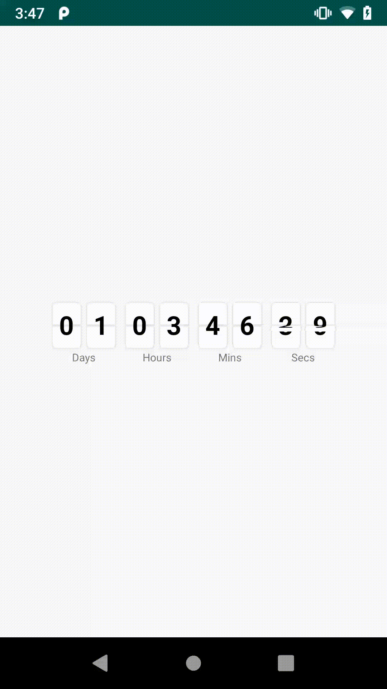

# FlipTimerView
[](https://jitpack.io/#anugotta/FlipTimerView)
[]()
[](https://android-arsenal.com/api?level=16)
[]( https://android-arsenal.com/details/1/7634 )


## Preview



FlipTimerView library for Android

## Getting started
Add it in your root build.gradle at the end of repositories:

	allprojects {
		repositories {
			...
			maven { url 'https://jitpack.io' }
		}
	}
Step 2. Add the dependency

	dependencies {
	        implementation 'com.github.anugotta:FlipTimerView:v1.3'
	}
  

## Usage
Add the CountDownClock in your layout

```
  <com.asp.fliptimerviewlibrary.CountDownClock
            android:id="@+id/timerProgramCountdown"
            android:layout_width="wrap_content"
            android:layout_height="wrap_content"
            android:layout_gravity="center"
            android:clipChildren="false"
            android:clipToPadding="false"
            flipTimer:almostFinishedCallbackTimeInSeconds="5"
            flipTimer:animationDuration="850"
            flipTimer:countdownTickInterval="1000"
            flipTimer:digitBottomDrawable="@drawable/background_bottom"
            flipTimer:digitDividerColor="@color/transparent"
            flipTimer:digitPadding="2dp"
            flipTimer:digitTextColor="@color/black"
            flipTimer:digitTextSize="24sp"
            flipTimer:digitTopDrawable="@drawable/background_top"
            flipTimer:digitWidth="28dp"
            flipTimer:halfDigitHeight="22dp"
            flipTimer:resetSymbol="8"
            flipTimer:splitterPadding="0dp"
    />
```

## API
```kotlin
 timerProgramCountdown.startCountDown(99999999)
        timerProgramCountdown.setCountdownListener(object : CountDownClock.CountdownCallBack {
            override fun countdownAboutToFinish() {
                //TODO Add your code here
            }

            override fun countdownFinished() {
                Toast.makeText(this@MainActivity, "Finished", Toast.LENGTH_SHORT).show()
                timerProgramCountdown.resetCountdownTimer()
            }
        })
```

## Contribution

If you are interested to contribute, feel free to send pull requests or issues.

**Note:** All your pull requests should be written in kotlin

## Questions?
Hit me on twitter [](https://twitter.com/as_pillai)

## License

    MIT License

    Copyright (c) 2019 Anu S Pillai

    Permission is hereby granted, free of charge, to any person obtaining a copy
    of this software and associated documentation files (the "Software"), to deal
    in the Software without restriction, including without limitation the rights
    to use, copy, modify, merge, publish, distribute, sublicense, and/or sell
    copies of the Software, and to permit persons to whom the Software is
    furnished to do so, subject to the following conditions:

    The above copyright notice and this permission notice shall be included in all
    copies or substantial portions of the Software.

    THE SOFTWARE IS PROVIDED "AS IS", WITHOUT WARRANTY OF ANY KIND, EXPRESS OR
    IMPLIED, INCLUDING BUT NOT LIMITED TO THE WARRANTIES OF MERCHANTABILITY,
    FITNESS FOR A PARTICULAR PURPOSE AND NONINFRINGEMENT. IN NO EVENT SHALL THE
    AUTHORS OR COPYRIGHT HOLDERS BE LIABLE FOR ANY CLAIM, DAMAGES OR OTHER
    LIABILITY, WHETHER IN AN ACTION OF CONTRACT, TORT OR OTHERWISE, ARISING FROM,
    OUT OF OR IN CONNECTION WITH THE SOFTWARE OR THE USE OR OTHER DEALINGS IN THE
    SOFTWARE.

